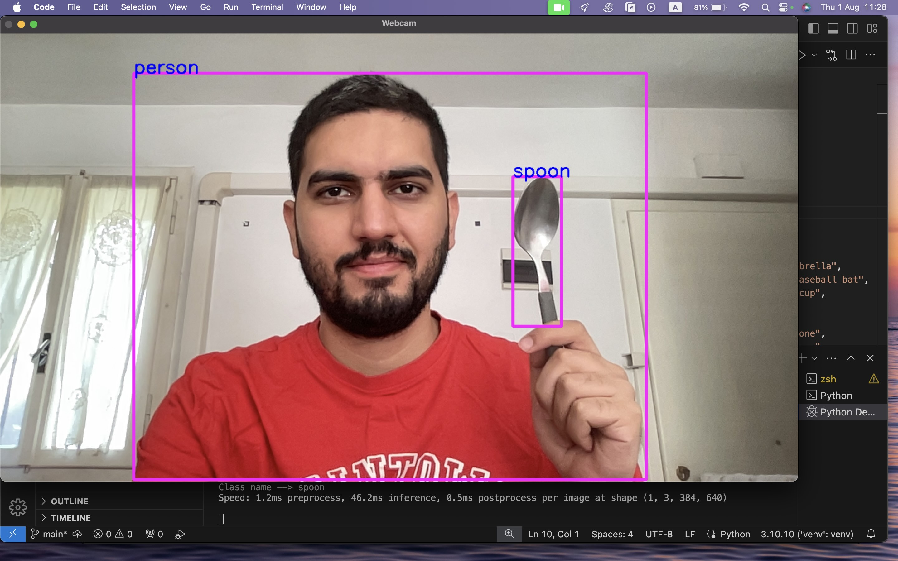

# Real-time Object Detection using YOLO and OpenCV (WebCam)
Python script for real-time object detection using the webcam. It utilizes the YOLO (You Only Look Once) algorithm, imported from the ultralytics library, for detecting objects in video frames captured by OpenCV, a powerful library for computer vision tasks. The script sets the webcam's resolution, initializes the YOLO model with pre-trained weights, and continuously processes video frames to detect predefined object classes, drawing bounding boxes around detected objects and displaying their labels and confidence levels. The process repeats in a loop until the 'q' key is pressed, which stops the webcam and closes the application. This setup is particularly effective for applications needing immediate object detection and annotation in various environments.

## How to use
1- clone repository

2- install dependencies
pip install opencv-python
pip install ultralytics

3- run main.py